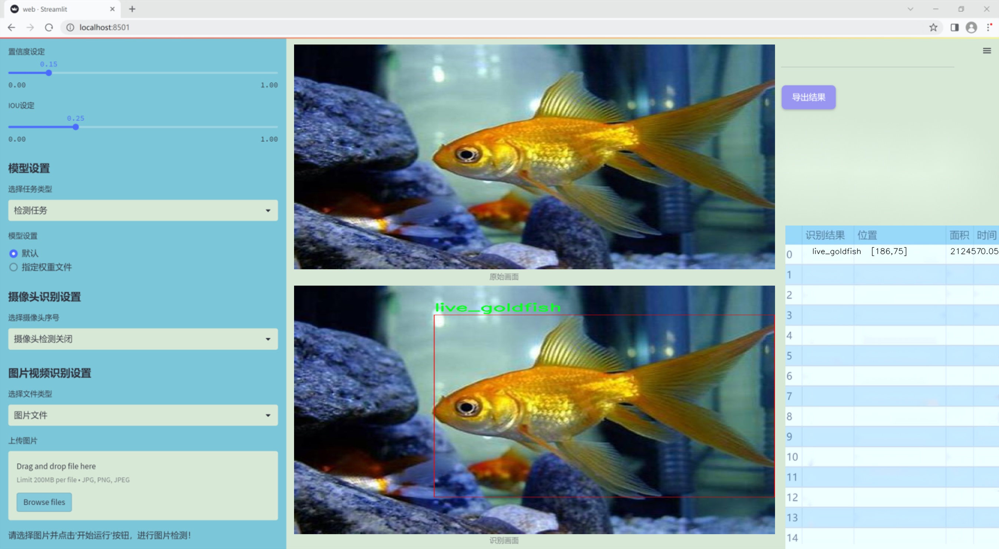
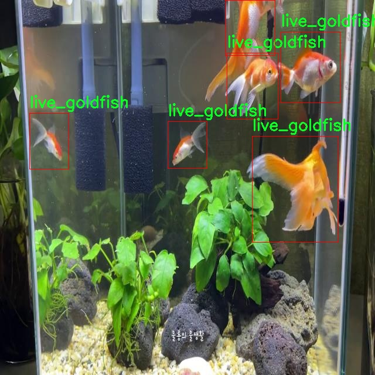

# 改进yolo11-DynamicHGNetV2等200+全套创新点大全：金鱼成体幼苗检测活体识别系统源码＆数据集全套

### 1.图片效果展示





##### 项目来源 **[人工智能促进会 2024.10.30](https://kdocs.cn/l/cszuIiCKVNis)**

注意：由于项目一直在更新迭代，上面“1.图片效果展示”和“2.视频效果展示”展示的系统图片或者视频可能为老版本，新版本在老版本的基础上升级如下：（实际效果以升级的新版本为准）

  （1）适配了YOLOV11的“目标检测”模型和“实例分割”模型，通过加载相应的权重（.pt）文件即可自适应加载模型。

  （2）支持“图片识别”、“视频识别”、“摄像头实时识别”三种识别模式。

  （3）支持“图片识别”、“视频识别”、“摄像头实时识别”三种识别结果保存导出，解决手动导出（容易卡顿出现爆内存）存在的问题，识别完自动保存结果并导出到tempDir中。

  （4）支持Web前端系统中的标题、背景图等自定义修改。

  另外本项目提供训练的数据集和训练教程,暂不提供权重文件（best.pt）,需要您按照教程进行训练后实现图片演示和Web前端界面演示的效果。

### 2.视频效果展示

[2.1 视频效果展示](https://www.bilibili.com/video/BV1uDSiYJE53/)

### 3.背景

研究背景与意义

随着水产养殖业的快速发展，金鱼作为一种重要的观赏鱼类，其养殖和管理面临着越来越多的挑战。金鱼的成体与幼苗在生长阶段的管理对于提高养殖效率、降低成本以及保障生态环境具有重要意义。然而，传统的人工检测方法不仅耗时耗力，而且容易受到人为因素的影响，导致检测结果的准确性和一致性降低。因此，开发一种高效、准确的金鱼成体与幼苗检测系统显得尤为重要。

近年来，深度学习技术在计算机视觉领域取得了显著进展，尤其是目标检测模型如YOLO（You Only Look Once）系列，因其实时性和高精度而受到广泛关注。YOLOv11作为该系列的最新版本，结合了更为先进的特征提取和处理算法，能够在复杂环境中快速、准确地识别和分类目标。基于YOLOv11的金鱼成体与幼苗检测活体识别系统，能够有效提升金鱼养殖过程中的自动化水平，减少人工干预，提高养殖管理的科学性和精准性。

本研究将利用包含781张图像的金鱼数据集，该数据集涵盖了三类目标：幼苗金鱼（baby_fish）和活体金鱼（live_goldfish）。通过对这些数据的深入分析与处理，结合YOLOv11的改进算法，旨在构建一个高效的金鱼检测系统，实现对金鱼成体与幼苗的实时监测与识别。这不仅有助于提高金鱼养殖的管理效率，还为相关领域的研究提供了重要的数据支持和技术参考，推动水产养殖业的智能化发展。

### 4.数据集信息展示

##### 4.1 本项目数据集详细数据（类别数＆类别名）

nc: 2
names: ['baby_fish', 'live_goldfish']


该项目为【目标检测】数据集，请在【训练教程和Web端加载模型教程（第三步）】这一步的时候按照【目标检测】部分的教程来训练

##### 4.2 本项目数据集信息介绍

本项目数据集信息介绍

本项目所使用的数据集名为“gold_fish”，旨在为改进YOLOv11的金鱼成体幼苗检测活体识别系统提供高质量的训练数据。该数据集专注于金鱼的两个主要类别，分别是“baby_fish”（幼鱼）和“live_goldfish”（活体金鱼），共计包含2个类别。这一数据集的构建不仅考虑了金鱼的生物特征，还注重了不同生长阶段的表现，以便更好地训练模型进行精确识别。

在数据集的收集过程中，我们采用了多种拍摄环境和光照条件，以确保数据的多样性和代表性。每个类别的样本均涵盖了不同的姿态、角度和背景，从而增强模型的泛化能力。通过这种方式，我们希望能够提高YOLOv11在实际应用中的识别准确率，尤其是在复杂环境下的表现。

此外，数据集中的每个图像都经过精确标注，确保模型在训练过程中能够学习到金鱼的特征。这些标注不仅包括金鱼的边界框，还提供了每个类别的详细信息，便于后续的分析和评估。我们还对数据集进行了适当的扩充和增强处理，以增加样本的多样性，从而进一步提升模型的鲁棒性。

总之，“gold_fish”数据集为金鱼成体幼苗检测活体识别系统的开发提供了坚实的基础。通过利用这一数据集，我们期望能够实现更高效、更准确的金鱼识别，为相关领域的研究和应用提供有力支持。




### 5.全套项目环境部署视频教程（零基础手把手教学）

[5.1 所需软件PyCharm和Anaconda安装教程（第一步）](https://www.bilibili.com/video/BV1BoC1YCEKi/?spm_id_from=333.999.0.0&vd_source=bc9aec86d164b67a7004b996143742dc)


[5.2 安装Python虚拟环境创建和依赖库安装视频教程（第二步）](https://www.bilibili.com/video/BV1ZoC1YCEBw?spm_id_from=333.788.videopod.sections&vd_source=bc9aec86d164b67a7004b996143742dc)

### 6.改进YOLOv11训练教程和Web_UI前端加载模型教程（零基础手把手教学）

[6.1 改进YOLOv11训练教程和Web_UI前端加载模型教程（第三步）](https://www.bilibili.com/video/BV1BoC1YCEhR?spm_id_from=333.788.videopod.sections&vd_source=bc9aec86d164b67a7004b996143742dc)


按照上面的训练视频教程链接加载项目提供的数据集，运行train.py即可开始训练



     Epoch   gpu_mem       box       obj       cls    labels  img_size
     1/200     20.8G   0.01576   0.01955  0.007536        22      1280: 100%|██████████| 849/849 [14:42<00:00,  1.04s/it]
               Class     Images     Labels          P          R     mAP@.5 mAP@.5:.95: 100%|██████████| 213/213 [01:14<00:00,  2.87it/s]
                 all       3395      17314      0.994      0.957      0.0957      0.0843

     Epoch   gpu_mem       box       obj       cls    labels  img_size
     2/200     20.8G   0.01578   0.01923  0.007006        22      1280: 100%|██████████| 849/849 [14:44<00:00,  1.04s/it]
               Class     Images     Labels          P          R     mAP@.5 mAP@.5:.95: 100%|██████████| 213/213 [01:12<00:00,  2.95it/s]
                 all       3395      17314      0.996      0.956      0.0957      0.0845

     Epoch   gpu_mem       box       obj       cls    labels  img_size
     3/200     20.8G   0.01561    0.0191  0.006895        27      1280: 100%|██████████| 849/849 [10:56<00:00,  1.29it/s]
               Class     Images     Labels          P          R     mAP@.5 mAP@.5:.95: 100%|███████   | 187/213 [00:52<00:00,  4.04it/s]
                 all       3395      17314      0.996      0.957      0.0957      0.0845


###### [项目数据集下载链接](https://kdocs.cn/l/cszuIiCKVNis)

### 7.原始YOLOv11算法讲解


ultralytics发布了最新的作品YOLOv11，这一次YOLOv11的变化相对于ultralytics公司的上一代作品YOLOv8变化不是很大的（YOLOv9、YOLOv10均不是ultralytics公司作品），其中改变的位置涉及到C2f变为C3K2，在SPPF后面加了一层类似于注意力机制的C2PSA，还有一个变化大家从yaml文件是看不出来的就是它的检测头内部替换了两个DWConv，以及模型的深度和宽度参数进行了大幅度调整，但是在损失函数方面就没有变化还是采用的CIoU作为边界框回归损失，下面带大家深入理解一下ultralytics最新作品YOLOv11的创新点。

**下图为最近的YOLO系列发布时间线！**


* * *

###### YOLOv11和YOLOv8对比

在YOLOYOLOv5，YOLOv8，和YOLOv11是ultralytics公司作品（ultralytics出品必属精品），下面用一张图片从yaml文件来带大家对比一下YOLOv8和YOLOv11的区别，配置文件变得内容比较少大家可以看一卡，左侧为YOLOv8右侧为YOLOv11，不同的点我用黑线标注了出来。


* * *

###### YOLOv11的网络结构解析

下面的图片为YOLOv11的网络结构图。


**其中主要创新点可以总结如下- > **

* * *

1\.
提出C3k2机制，其中C3k2有参数为c3k，其中在网络的浅层c3k设置为False（下图中可以看到c3k2第二个参数被设置为False，就是对应的c3k参数）。


此时所谓的C3k2就相当于YOLOv8中的C2f，其网络结构为一致的，其中的C3k机制的网络结构图如下图所示
**（为什么叫C3k2，我个人理解是因为C3k的调用时C3k其中的参数N固定设置为2的原因，个人理解不一定对** ）。


* * *

2\.
第二个创新点是提出C2PSA机制，这是一个C2（C2f的前身）机制内部嵌入了一个多头注意力机制，在这个过程中我还发现作者尝试了C2fPSA机制但是估计效果不如C2PSA，有的时候机制有没有效果理论上真的很难解释通，下图为C2PSA机制的原理图，仔细观察把Attention哪里去掉则C2PSA机制就变为了C2所以我上面说C2PSA就是C2里面嵌入了一个PSA机制。


* * *

3\.
第三个创新点可以说是原先的解耦头中的分类检测头增加了两个DWConv，具体的对比大家可以看下面两个图下面的是YOLOv11的解耦头，上面的是YOLOv8的解耦头.


我们上面看到了在分类检测头中YOLOv11插入了两个DWConv这样的做法可以大幅度减少参数量和计算量（原先两个普通的Conv大家要注意到卷积和是由3变为了1的，这是形成了两个深度可分离Conv），大家可能不太理解为什么加入了两个DWConv还能够减少计算量，以及什么是深度可分离Conv，下面我来解释一下。

> **`DWConv` 代表 Depthwise
> Convolution（深度卷积）**，是一种在卷积神经网络中常用的高效卷积操作。它主要用于减少计算复杂度和参数量，尤其在移动端或轻量化网络（如
> MobileNet）中十分常见。
>
> **1\. 标准卷积的计算过程**
>
> 在标准卷积操作中，对于一个输入张量（通常是一个多通道的特征图），卷积核的尺寸是 `(h, w, C_in)`，其中 `h` 和 `w`
> 是卷积核的空间尺寸，`C_in`
> 是输入通道的数量。而卷积核与输入张量做的是完整的卷积运算，每个输出通道都与所有输入通道相连并参与卷积操作，导致计算量比较大。
>
> 标准卷积的计算过程是这样的：
>
>   * 每个输出通道是所有输入通道的组合（加权求和），卷积核在每个位置都会计算与所有输入通道的点积。
>   * 假设有 `C_in` 个输入通道和 `C_out` 个输出通道，那么卷积核的总参数量是 `C_in * C_out * h * w`。
>

>
> 2\. **Depthwise Convolution（DWConv）**
>
> 与标准卷积不同， **深度卷积** 将输入的每个通道单独处理，即 **每个通道都有自己的卷积核进行卷积**
> ，不与其他通道进行交互。它可以被看作是标准卷积的一部分，专注于空间维度上的卷积运算。
>
> **深度卷积的计算过程：**
>
>   * 假设输入张量有 `C_in` 个通道，每个通道会使用一个 `h × w`
> 的卷积核进行卷积操作。这个过程称为“深度卷积”，因为每个通道独立进行卷积运算。
>   * 输出的通道数与输入通道数一致，每个输出通道只和对应的输入通道进行卷积，没有跨通道的组合。
>   * 参数量和计算量相比标准卷积大大减少，卷积核的参数量是 `C_in * h * w`。
>

>
> **深度卷积的优点：**
>
>   1. **计算效率高** ：相对于标准卷积，深度卷积显著减少了计算量。它只处理空间维度上的卷积，不再处理通道间的卷积。
>   2.  **参数量减少** ：由于每个卷积核只对单个通道进行卷积，参数量大幅减少。例如，标准卷积的参数量为 `C_in * C_out * h *
> w`，而深度卷积的参数量为 `C_in * h * w`。
>   3.  **结合点卷积可提升效果** ：为了弥补深度卷积缺乏跨通道信息整合的问题，通常深度卷积后会配合 `1x1` 的点卷积（Pointwise
> Convolution）使用，通过 `1x1` 的卷积核整合跨通道的信息。这种组合被称为 **深度可分离卷积** （Depthwise
> Separable Convolution） | **这也是我们本文YOLOv11中的做法** 。
>

>
> 3\. **深度卷积与标准卷积的区别**
>
> 操作类型| 卷积核大小| 输入通道数| 输出通道数| 参数量  
> ---|---|---|---|---  
> 标准卷积| `h × w`| `C_in`| `C_out`| `C_in * C_out * h * w`  
> 深度卷积（DWConv）| `h × w`| `C_in`| `C_in`| `C_in * h * w`  
>  
> 可以看出，深度卷积在相同的卷积核大小下，参数量减少了约 `C_out` 倍
> （细心的人可以发现用最新版本的ultralytics仓库运行YOLOv8参数量相比于之前的YOLOv8以及大幅度减少了这就是因为检测头改了的原因但是名字还是Detect，所以如果你想继续用YOLOv8发表论文做实验那么不要更新最近的ultralytics仓库）。
>
> **4\. 深度可分离卷积 (Depthwise Separable Convolution)**
>
> 深度卷积常与 `1x1` 的点卷积配合使用，这称为深度可分离卷积。其过程如下：
>
>   1. 先对输入张量进行深度卷积，对每个通道独立进行空间卷积。
>   2. 然后通过 `1x1` 点卷积，对通道维度进行混合，整合不同通道的信息。
>

>
> 这样既可以保证计算量的减少，又可以保持跨通道的信息流动。
>
> 5\. **总结**
>
> `DWConv` 是一种高效的卷积方式，通过单独处理每个通道来减少计算量，结合 `1x1`
> 的点卷积，形成深度可分离卷积，可以在保持网络性能的同时极大地减少模型的计算复杂度和参数量。

**看到这里大家应该明白了为什么加入了两个DWConv还能减少参数量以及YOLOv11的检测头创新点在哪里。**

* * *

##### YOLOv11和YOLOv8还有一个不同的点就是其各个版本的模型（N - S - M- L - X）网络深度和宽度变了


可以看到在深度（depth）和宽度
（width）两个地方YOLOv8和YOLOv11是基本上完全不同了，这里我理解这么做的含义就是模型网络变小了，所以需要加深一些模型的放缩倍数来弥补模型之前丧失的能力从而来达到一个平衡。

> **本章总结：**
> YOLOv11的改进点其实并不多更多的都是一些小的结构上的创新，相对于之前的YOLOv5到YOLOv8的创新，其实YOLOv11的创新点不算多，但是其是ultralytics公司的出品，同时ultralytics仓库的使用量是非常多的（不像YOLOv9和YOLOv10）所以在未来的很长一段时间内其实YOLO系列估计不会再更新了，YOLOv11作为最新的SOTA肯定是十分适合大家来发表论文和创新的。
>

### 8.200+种全套改进YOLOV11创新点原理讲解

#### 8.1 200+种全套改进YOLOV11创新点原理讲解大全

由于篇幅限制，每个创新点的具体原理讲解就不全部展开，具体见下列网址中的改进模块对应项目的技术原理博客网址【Blog】（创新点均为模块化搭建，原理适配YOLOv5~YOLOv11等各种版本）

[改进模块技术原理博客【Blog】网址链接](https://gitee.com/qunmasj/good)


#### 8.2 精选部分改进YOLOV11创新点原理讲解

###### 这里节选部分改进创新点展开原理讲解(完整的改进原理见上图和[改进模块技术原理博客链接](https://gitee.com/qunmasj/good)【如果此小节的图加载失败可以通过CSDN或者Github搜索该博客的标题访问原始博客，原始博客图片显示正常】



### Diverse Branch Block简介
参考该博客提出的一种通用的卷积网络构造块用来在不增加任何推理时间的前提下提升卷积网络的性能。我们将这个块命名为分离分支块（Diverse Branch Block）。通过结合不同尺寸和复杂度的分离分支（包括串联卷积、多尺度卷积和平均池化层）来增加特征空间的方法，它提升了单个卷积的表达能力。完成训练后，一个DBB(Diverse Branch Block)可以被等价地转换为一个单独的卷积操作以方便部署。不同于那些新颖的卷积结构的改进方式，DBB让训练时微结构复杂化同时维持大规模结构，因此我们可以将它作为任意结构中通用卷积层的一种嵌入式替代形式。通过这种方式，我们能够将模型训练到一个更高的表现水平，然后在推理时转换成原始推理时间的结构。

 
主要贡献点：

（1） 我们建议合并大量的微结构到不同的卷积结构中来提升性能，但是维持原始的宏观结构。

（2）我们提出DBB，一个通用构造块结构，概括六种转换来将一个DBB结构转化成一个单独卷积，因为对于用户来说它是无损的。

（3）我们提出一个Inception-like DBB结构实例(Fig 1)，并且展示它在ImageNet、COCO detection 和CityScapes任务中获得性能提升。


#### 结构重参数化
本文和一个并发网络RepVGG[1]是第一个使用结构重参数化来命名该思路------使用从其他结构转化来的参数确定当前结构的参数。一个之前的工作ACNet[2]也可以被划分为结构重参数化，它提出使用非对称卷积块来增强卷积核的结构（i.e 十字形结构）。相比于DBB，它被设计来提升卷积网络（在没有额外推理时间损失的条件下）。这个流水线也包含将一个训练好的模型转化为另一个。但是，ACNet和DBB的区别是：ACNet的思想被激发是基于一个观察，这个观察是网络结构的参数在过去有更大的量级，因此寻找方法让参数量级更大，然而我们关注一个不同的点。我们发现 平均池化、1x1 conv 和 1x1-kxk串联卷积是更有效的，因为它们提供了不同复杂度的路线，以及允许使用更多训练时非线性化。除此以外，ACB结构可以看作是DBB结构的一种特殊形式，因为那个1xk和kx1卷积层能够被扩大成kxk（via Transform VI(Fig.2)），然后合并成一个平方核（via Transform II）。

 

#### 分离分支结构
卷积的线性性
一个卷积操作可以表示为 ，其中为输入tensor, 为输出tensor。卷积核表示为一个四阶tensor , 偏置为。将加偏置的操作表示为。

因为，在第j个输出通道（h,w）位置的值可以由以下公式给出：，其中表示输入帧I的第c个通道上的一个滑动窗，对应输出帧O的坐标（h,w）。从上式可以看出，卷积操作具有齐次性和加法性。


注意：加法性成立的条件是两个卷积具有相同的配置（即通道数、核尺寸、步长和padding等）。

#### 分离分支的卷积
在这一小节，我们概括六种转换形式（Fig.2）来转换一个具有batch normalization(BN)、branch addition、depth concatenation、multi-scale operations、avarage pooling 和 sequences of convolutions的DBB分支。


Transform I：a conv for conv-BN  我们通常会给一个卷积配备配备一个BN层，它执行逐通道正则化和线性尺度放缩。设j为通道索引，分别为累积的逐通道均值和标准差，分别为学习的尺度因子和偏置项，对应输出通道j为


卷积的齐次性允许我们融合BN操作到前述的conv来做推理。在实践中，我们仅仅建立一个拥有卷积核和偏置, 用从原始BN序列的参数转换来的值来赋值。我们为每个输出通道j构造


Transform II a conv for branch addition  卷积的加法性确保如果有两个或者多个具有相同配置的卷积层相加，我们能够将它们合并到一个单独的卷积里面。对于conv-BN，我们应该首先执行Transform I。很明显的，通过下面的公式我们能够合并两个卷积


上述公式只有在两个卷积拥有相同配置时才成立。尽管合并上述分支能够在一定程度上增强模型，我们希望结合不同分支来进一步提升模型性能。在后面，我们介绍一些分支的形式，它们能够等价地被转化为一个单独的卷积。在通过多个转化来为每一个分支构造KxK的卷积之后，我们使用Transform II 将所有分支合并到一个conv里面。

Transform III: a conv for sequential convolutions   我们能够合并一个1x1 conv-BN-kxk conv序列到一个kxk conv里面。我们暂时假设卷积是稠密的（即 组数 groups=1）。组数groups>1的情形将会在Transform IV中实现。我们假定1x1和kxk卷积层的核形状分别是DxCx1x1和ExDxKxK，这里D指任意值。首先，我们将两个BN层融合到两个卷积层里面，由此获得。输出是


我们期望用一个单独卷积的核和偏置来表达，设, 它们满足。对方程（8）应用卷积的加法性，我们有


因为是一个1x1 conv，它只执行逐通道线性组合，没有空间聚合操作。通过线性重组KxK卷积核中的参数，我们能够将它合并到一个KxK的卷积核里面。容易证明的是，这样的转换可以由一个转置卷积实现：


其中是由转置获得的tensor张量。方程（10）的第二项是作用于常量矩阵上的卷积操作，因此它的输出也是一个常量矩阵。用表达式来说明，设是一个常数矩阵，其中的每个元素都等于p。*是一个2D 卷积操作，W为一个2D 卷积核。转换结果就是一个常量矩阵，这个常量矩阵是p 与 所有核元素之和 的乘积，即


基于以上观察，我们构造。然后，容易证明。

因此我们有

显而易见地，对于一个zero-pads 的KxK卷积，方程（8）并不成立，因为并不对的结果做卷积操作(如果有一个零元素的额外的圈，方程（8）成立)。解决方案有A)用padding配置第一个卷积，第二个卷积不用，B)通过做pad操作。后者的一个有效实现是定制第一个BN层，为了（1）如通常的batch-normalize输入。（2）计算(通过方程（6）)。（3）用  pad batch-normalized结果，例如 用一圈 pad 每一个通道j 。

Transform IV: a conv for depth concatenation  Inception 单元使用深度concatenation来组合不同分支。当每个分支都只包含一个相同配置的卷积时，深度concatenation等价于一个卷积，它的核在不同的输出通道上concatenation（比如我们公式中的第一个轴）假设。我们concatenate它们到。显然地


Transform IV 可以非常方便地将Transform III 扩展到 groupwise（即 groups > 1） 的情景。直觉上，一个groupwise 卷积将输入分割成g个并行的组，单独卷积它们，然后concatenate形成输出。为了代替g-group卷积，我们建立一个DBB结构，这个结构的所有卷积层有相同的组g。为了转换一个1x1-KxK序列，我们等价地分割它们成为g组，单独执行Transform III, 然后concatenate获得输出（如图Fig3所示）。


Transform V: a conv for average pooling  一个作用于C通道的核尺寸为K，步长为s的平均池化层等价于一个拥有相同核尺寸K,步长s的卷积层。这样的核可以被构造为

  


就像一个通常的平均池化操作，当s>1时执行降采样操作，当s=1时保持相同尺寸。

Transform VI: a conv for multi-scale convolutions   考虑一个等价于一个拥有相同zero padding的 核。特别地，卷积是格外实用的，因为它们能够有效实现。应该对输入作pad操作来对齐滑动窗。


### 9.系统功能展示

图9.1.系统支持检测结果表格显示

  图9.2.系统支持置信度和IOU阈值手动调节

  图9.3.系统支持自定义加载权重文件best.pt(需要你通过步骤5中训练获得)

  图9.4.系统支持摄像头实时识别

  图9.5.系统支持图片识别

  图9.6.系统支持视频识别

  图9.7.系统支持识别结果文件自动保存

  图9.8.系统支持Excel导出检测结果数据


### 10. YOLOv11核心改进源码讲解

#### 10.1 test_selective_scan_easy.py

以下是对给定代码的核心部分进行提炼和详细注释的结果：

```python
import torch
import torch.nn.functional as F

def selective_scan_easy(us, dts, As, Bs, Cs, Ds, delta_bias=None, delta_softplus=False, return_last_state=False, chunksize=64):
    """
    选择性扫描函数，执行一个基于输入的递归计算。
    
    参数:
    us: 输入张量，形状为 (B, G * D, L)
    dts: 时间增量张量，形状为 (B, G * D, L)
    As: 权重矩阵，形状为 (G * D, N)
    Bs: 权重矩阵，形状为 (B, G, N, L)
    Cs: 权重矩阵，形状为 (B, G, N, L)
    Ds: 偏置项，形状为 (G * D)
    delta_bias: 可选的偏置调整，形状为 (G * D)
    delta_softplus: 是否应用softplus函数
    return_last_state: 是否返回最后的状态
    chunksize: 每次处理的序列长度
    """
    
    def selective_scan_chunk(us, dts, As, Bs, Cs, hprefix):
        """
        处理输入的一个块，执行选择性扫描的核心计算。
        
        参数:
        us: 输入张量的一个块
        dts: 时间增量张量的一个块
        As: 权重矩阵
        Bs: 权重矩阵的一个块
        Cs: 权重矩阵的一个块
        hprefix: 前一个状态的输出
        
        返回:
        ys: 当前块的输出
        hs: 当前块的状态
        """
        ts = dts.cumsum(dim=0)  # 计算时间增量的累积和
        Ats = torch.einsum("gdn,lbgd->lbgdn", As, ts).exp()  # 计算权重的指数
        rAts = Ats  # 归一化处理
        duts = dts * us  # 计算输入和时间增量的乘积
        dtBus = torch.einsum("lbgd,lbgn->lbgdn", duts, Bs)  # 计算加权输入
        hs_tmp = rAts * (dtBus / rAts).cumsum(dim=0)  # 计算当前状态
        hs = hs_tmp + Ats * hprefix.unsqueeze(0)  # 更新状态
        ys = torch.einsum("lbgn,lbgdn->lbgd", Cs, hs)  # 计算输出
        return ys, hs

    # 数据类型设置
    dtype = torch.float32
    inp_dtype = us.dtype
    has_D = Ds is not None  # 检查是否有偏置项
    if chunksize < 1:
        chunksize = Bs.shape[-1]  # 设置块大小

    # 数据预处理
    dts = dts.to(dtype)
    if delta_bias is not None:
        dts = dts + delta_bias.view(1, -1, 1).to(dtype)  # 应用偏置调整
    if delta_softplus:
        dts = F.softplus(dts)  # 应用softplus函数

    # 维度调整
    Bs = Bs.unsqueeze(1) if len(Bs.shape) == 3 else Bs
    Cs = Cs.unsqueeze(1) if len(Cs.shape) == 3 else Cs
    B, G, N, L = Bs.shape
    us = us.view(B, G, -1, L).permute(3, 0, 1, 2).to(dtype)
    dts = dts.view(B, G, -1, L).permute(3, 0, 1, 2).to(dtype)
    As = As.view(G, -1, N).to(dtype)
    Bs = Bs.permute(3, 0, 1, 2).to(dtype)
    Cs = Cs.permute(3, 0, 1, 2).to(dtype)
    Ds = Ds.view(G, -1).to(dtype) if has_D else None
    D = As.shape[1]

    oys = []  # 输出列表
    hprefix = us.new_zeros((B, G, D, N), dtype=dtype)  # 初始化前一个状态
    for i in range(0, L, chunksize):
        ys, hs = selective_scan_chunk(
            us[i:i + chunksize], dts[i:i + chunksize], 
            As, Bs[i:i + chunksize], Cs[i:i + chunksize], hprefix, 
        )
        oys.append(ys)  # 收集输出
        hprefix = hs[-1]  # 更新前一个状态

    oys = torch.cat(oys, dim=0)  # 合并所有输出
    if has_D:
        oys = oys + Ds * us  # 添加偏置项
    oys = oys.permute(1, 2, 3, 0).view(B, -1, L)  # 调整输出维度

    return oys.to(inp_dtype) if not return_last_state else (oys.to(inp_dtype), hprefix.view(B, G * D, N).float())

# 选择性扫描类，支持反向传播
class SelectiveScanEasy(torch.autograd.Function):
    @staticmethod
    @torch.cuda.amp.custom_fwd(cast_inputs=torch.float32)
    def forward(ctx, us, dts, As, Bs, Cs, Ds, delta_bias=None, delta_softplus=False, return_last_state=False, chunksize=64):
        # 省略了中间步骤，直接调用selective_scan_easy
        return selective_scan_easy(us, dts, As, Bs, Cs, Ds, delta_bias, delta_softplus, return_last_state, chunksize)

    @staticmethod
    @torch.cuda.amp.custom_bwd
    def backward(ctx, doys: torch.Tensor, *args):
        # 反向传播的实现
        pass  # 省略反向传播的实现细节

# 其他辅助函数和测试代码省略...
```

### 代码分析
1. **核心功能**: `selective_scan_easy` 函数实现了选择性扫描的核心逻辑，主要用于处理时间序列数据的递归计算。它通过对输入张量进行块处理，计算每个块的输出和状态，并在最后合并结果。

2. **数据处理**: 函数对输入数据进行了预处理，包括维度调整、类型转换和偏置调整等，以确保后续计算的正确性。

3. **块处理**: 内部的 `selective_scan_chunk` 函数负责处理每个数据块的计算，利用累积和和张量运算实现了递归关系的计算。

4. **反向传播**: `SelectiveScanEasy` 类实现了 PyTorch 的自定义自动求导功能，支持反向传播。

5. **注释**: 在代码中添加了详细的中文注释，解释了每个函数的参数、返回值及其功能，便于理解和维护。

以上是对给定代码的核心部分提炼和详细注释的结果，保留了实现的主要逻辑和功能。

这个文件 `test_selective_scan_easy.py` 是一个用于测试和实现选择性扫描（Selective Scan）算法的 Python 脚本，主要依赖于 PyTorch 库。选择性扫描是一种在序列数据上进行高效计算的技术，常用于时间序列分析和深度学习模型中。以下是对该文件的逐行分析和说明。

首先，文件导入了一些必要的库，包括 `math`、`functools`、`torch`、`torch.nn.functional`、`pytest` 和 `einops`。这些库提供了数学运算、函数式编程、张量操作和测试框架的支持。

接下来，定义了一个名为 `selective_scan_easy` 的函数，它实现了选择性扫描的核心逻辑。该函数接受多个参数，包括输入序列 `us`、时间增量 `dts`、以及一系列矩阵 `As`、`Bs`、`Cs` 和 `Ds`。函数的目的是在给定的时间序列上执行选择性扫描，并返回计算结果。

在 `selective_scan_easy` 函数内部，首先定义了一个名为 `selective_scan_chunk` 的内部函数，用于处理输入数据的一个块。该函数实现了选择性扫描的数学公式，使用了张量运算来高效计算输出。

函数接着处理输入数据的维度和类型，确保它们符合预期的格式。通过对输入数据进行重塑和转置，函数准备好进行后续的计算。

接下来，函数通过循环将输入数据分块处理，每次处理 `chunksize` 大小的块，并调用 `selective_scan_chunk` 函数进行计算。最终，所有块的结果被拼接在一起，形成最终的输出。

`SelectiveScanEasy` 类是一个自定义的 PyTorch 自动求导函数，包含 `forward` 和 `backward` 方法。`forward` 方法实现了前向传播的逻辑，而 `backward` 方法则实现了反向传播，计算梯度。这个类允许在计算图中跟踪操作，以便在训练模型时自动计算梯度。

文件中还定义了多个版本的选择性扫描函数（如 `selective_scan_easyv2` 和 `selective_scan_easyv3`），这些版本可能在实现细节上有所不同，以适应不同的需求或优化性能。

在文件的最后部分，使用 `pytest` 框架定义了一个测试函数 `test_selective_scan`，该函数通过参数化测试不同的输入条件，验证选择性扫描的实现是否正确。测试包括对输入数据的不同形状、数据类型和其他参数的组合进行验证，确保实现的稳定性和准确性。

总体而言，这个文件提供了一个完整的选择性扫描算法的实现，包括前向和反向传播的逻辑，以及相应的测试用例，旨在确保算法在不同情况下的正确性和性能。

#### 10.2 metaformer.py

以下是代码中最核心的部分，并附上详细的中文注释：

```python
import torch
import torch.nn as nn
import torch.nn.functional as F

class MF_Attention(nn.Module):
    """
    自注意力机制（Vanilla Self-Attention）实现，源自Transformer。
    """
    def __init__(self, dim, head_dim=32, num_heads=None, qkv_bias=False,
                 attn_drop=0., proj_drop=0., proj_bias=False):
        super().__init__()

        # 设置每个头的维度
        self.head_dim = head_dim
        # 缩放因子
        self.scale = head_dim ** -0.5

        # 计算头的数量
        self.num_heads = num_heads if num_heads else dim // head_dim
        if self.num_heads == 0:
            self.num_heads = 1
        
        # 总的注意力维度
        self.attention_dim = self.num_heads * self.head_dim

        # 定义Q、K、V的线性变换
        self.qkv = nn.Linear(dim, self.attention_dim * 3, bias=qkv_bias)
        # 注意力的dropout层
        self.attn_drop = nn.Dropout(attn_drop)
        # 输出的线性变换
        self.proj = nn.Linear(self.attention_dim, dim, bias=proj_bias)
        # 输出的dropout层
        self.proj_drop = nn.Dropout(proj_drop)

    def forward(self, x):
        # 获取输入的批次大小、宽度、高度和通道数
        B, H, W, C = x.shape
        N = H * W  # 计算总的序列长度

        # 计算Q、K、V
        qkv = self.qkv(x).reshape(B, N, 3, self.num_heads, self.head_dim).permute(2, 0, 3, 1, 4)
        q, k, v = qkv.unbind(0)  # 将Q、K、V分开

        # 计算注意力分数
        attn = (q @ k.transpose(-2, -1)) * self.scale
        attn = attn.softmax(dim=-1)  # 归一化
        attn = self.attn_drop(attn)  # 应用dropout

        # 计算输出
        x = (attn @ v).transpose(1, 2).reshape(B, H, W, self.attention_dim)
        x = self.proj(x)  # 线性变换
        x = self.proj_drop(x)  # 应用dropout
        return x  # 返回输出

class Mlp(nn.Module):
    """
    多层感知机（MLP）实现，常用于MetaFormer模型。
    """
    def __init__(self, dim, mlp_ratio=4, out_features=None, act_layer=nn.ReLU, drop=0., bias=False):
        super().__init__()
        in_features = dim
        out_features = out_features or in_features
        hidden_features = int(mlp_ratio * in_features)

        # 定义第一层线性变换
        self.fc1 = nn.Linear(in_features, hidden_features, bias=bias)
        self.act = act_layer()  # 激活函数
        self.drop1 = nn.Dropout(drop)  # dropout层
        # 定义第二层线性变换
        self.fc2 = nn.Linear(hidden_features, out_features, bias=bias)
        self.drop2 = nn.Dropout(drop)  # dropout层

    def forward(self, x):
        x = self.fc1(x)  # 第一层线性变换
        x = self.act(x)  # 激活
        x = self.drop1(x)  # 应用dropout
        x = self.fc2(x)  # 第二层线性变换
        x = self.drop2(x)  # 应用dropout
        return x  # 返回输出

class MetaFormerBlock(nn.Module):
    """
    MetaFormer块的实现。
    """
    def __init__(self, dim,
                 token_mixer=nn.Identity, mlp=Mlp,
                 norm_layer=nn.LayerNorm,
                 drop=0., drop_path=0.,
                 layer_scale_init_value=None, res_scale_init_value=None):
        super().__init__()

        # 归一化层
        self.norm1 = norm_layer(dim)
        # 令牌混合器
        self.token_mixer = token_mixer(dim=dim, drop=drop)
        # dropout路径
        self.drop_path1 = nn.Dropout(drop_path) if drop_path > 0. else nn.Identity()
        # 层缩放
        self.layer_scale1 = nn.Parameter(torch.ones(dim)) if layer_scale_init_value else nn.Identity()
        self.res_scale1 = nn.Parameter(torch.ones(dim)) if res_scale_init_value else nn.Identity()

        # 第二个归一化层
        self.norm2 = norm_layer(dim)
        # MLP
        self.mlp = mlp(dim=dim, drop=drop)
        self.drop_path2 = nn.Dropout(drop_path) if drop_path > 0. else nn.Identity()
        self.layer_scale2 = nn.Parameter(torch.ones(dim)) if layer_scale_init_value else nn.Identity()
        self.res_scale2 = nn.Parameter(torch.ones(dim)) if res_scale_init_value else nn.Identity()
        
    def forward(self, x):
        # 进行前向传播
        x = x.permute(0, 2, 3, 1)  # 调整维度顺序
        x = self.res_scale1(x) + \
            self.layer_scale1(
                self.drop_path1(
                    self.token_mixer(self.norm1(x))
                )
            )
        x = self.res_scale2(x) + \
            self.layer_scale2(
                self.drop_path2(
                    self.mlp(self.norm2(x))
                )
            )
        return x.permute(0, 3, 1, 2)  # 返回调整后的输出
```

### 代码核心部分说明：
1. **MF_Attention**: 实现了自注意力机制，计算输入的Q、K、V，并通过注意力分数生成输出。
2. **Mlp**: 实现了一个简单的多层感知机，包含两层线性变换和激活函数，适用于多种模型。
3. **MetaFormerBlock**: 组合了归一化、令牌混合、MLP和残差连接，构成了MetaFormer的基本构建块。

这些部分是构建MetaFormer模型的基础，能够实现特征提取和信息融合。

这个程序文件 `metaformer.py` 实现了一些用于构建 MetaFormer 模型的基础组件。代码主要由多个类组成，每个类代表一种特定的操作或模块，通常用于深度学习中的神经网络架构。

首先，文件引入了一些必要的库，包括 `torch` 和 `torch.nn`，这些是 PyTorch 框架的核心组件，提供了构建和训练神经网络所需的工具。`functools.partial` 被用来简化函数的调用。

接下来，定义了一些基本的模块，包括 `Scale`、`SquaredReLU` 和 `StarReLU`。`Scale` 类用于对输入进行逐元素的缩放，支持可训练的参数。`SquaredReLU` 和 `StarReLU` 是自定义的激活函数，分别实现了平方 ReLU 和带有缩放和偏置的 ReLU。

`MF_Attention` 类实现了自注意力机制，类似于 Transformer 中的自注意力。它通过线性变换生成查询、键和值，并计算注意力权重。然后，将注意力应用于值，并通过线性层进行投影。

`RandomMixing` 类用于对输入进行随机混合，生成一个随机矩阵并对输入进行线性变换。`LayerNormGeneral` 类实现了通用的层归一化，支持不同的输入形状和归一化维度。

`SepConv` 类实现了分离卷积，使用了深度可分离卷积的结构，先通过一个线性层进行通道扩展，然后通过深度卷积进行空间卷积，最后再通过另一个线性层进行通道压缩。

`Pooling` 类实现了一种特殊的池化操作，返回输入与池化结果之间的差异，适用于 PoolFormer 模型。

`Mlp` 类实现了多层感知机（MLP），包含两个线性层和激活函数，支持 dropout 操作。`ConvolutionalGLU` 类实现了卷积门控线性单元（GLU），结合了卷积操作和门控机制。

`MetaFormerBlock` 和 `MetaFormerCGLUBlock` 类实现了 MetaFormer 的基本模块，分别使用不同的 token 混合器和 MLP 结构。它们都包含了归一化、残差连接和可选的 dropout 操作。

整体来看，这个文件定义了一系列模块，这些模块可以组合在一起，构建出更复杂的神经网络架构，特别是用于图像处理和计算机视觉任务的 MetaFormer 模型。每个模块都遵循了现代深度学习的设计原则，具有良好的可扩展性和灵活性。

#### 10.3 hcfnet.py

以下是代码中最核心的部分，并附上详细的中文注释：

```python
import torch
import torch.nn as nn
import torch.nn.functional as F

class SpatialAttentionModule(nn.Module):
    def __init__(self):
        super(SpatialAttentionModule, self).__init__()
        # 定义一个卷积层，用于生成空间注意力图
        self.conv2d = nn.Conv2d(in_channels=2, out_channels=1, kernel_size=7, stride=1, padding=3)
        self.sigmoid = nn.Sigmoid()  # 使用Sigmoid激活函数将输出归一化到[0, 1]

    def forward(self, x):
        # 计算输入特征图的平均值和最大值
        avgout = torch.mean(x, dim=1, keepdim=True)  # 在通道维度上计算平均值
        maxout, _ = torch.max(x, dim=1, keepdim=True)  # 在通道维度上计算最大值
        # 将平均值和最大值拼接在一起
        out = torch.cat([avgout, maxout], dim=1)
        # 通过卷积层生成空间注意力图，并应用Sigmoid激活
        out = self.sigmoid(self.conv2d(out))
        return out * x  # 将注意力图与输入特征图相乘，进行加权

class PPA(nn.Module):
    def __init__(self, in_features, filters) -> None:
        super().__init__()
        # 定义各个卷积层和注意力模块
        self.skip = nn.Conv2d(in_features, filters, kernel_size=1, stride=1)  # 跳跃连接
        self.c1 = nn.Conv2d(filters, filters, kernel_size=3, padding=1)
        self.c2 = nn.Conv2d(filters, filters, kernel_size=3, padding=1)
        self.c3 = nn.Conv2d(filters, filters, kernel_size=3, padding=1)
        self.sa = SpatialAttentionModule()  # 空间注意力模块
        self.drop = nn.Dropout2d(0.1)  # Dropout层，防止过拟合
        self.bn1 = nn.BatchNorm2d(filters)  # 批归一化
        self.silu = nn.SiLU()  # SiLU激活函数

    def forward(self, x):
        # 通过各个卷积层和注意力模块进行前向传播
        x_skip = self.skip(x)  # 跳跃连接
        x1 = self.c1(x)
        x2 = self.c2(x1)
        x3 = self.c3(x2)
        # 将各个特征图相加
        x = x1 + x2 + x3 + x_skip
        x = self.sa(x)  # 应用空间注意力
        x = self.drop(x)  # 应用Dropout
        x = self.bn1(x)  # 批归一化
        x = self.silu(x)  # 应用SiLU激活
        return x  # 返回最终的特征图

class DASI(nn.Module):
    def __init__(self, in_features, out_features) -> None:
        super().__init__()
        self.tail_conv = nn.Conv2d(out_features, out_features, kernel_size=1)  # 尾部卷积层
        self.skips = nn.Conv2d(in_features[1], out_features, kernel_size=1)  # 跳跃连接卷积
        self.bns = nn.BatchNorm2d(out_features)  # 批归一化
        self.silu = nn.SiLU()  # SiLU激活函数

    def forward(self, x_list):
        # 从输入列表中提取不同尺度的特征图
        x_low, x, x_high = x_list
        x = self.skips(x)  # 应用跳跃连接卷积
        x_skip = x  # 保存跳跃连接的输出
        x = torch.chunk(x, 4, dim=1)  # 将特征图分成4个部分
        # 处理高和低特征图
        if x_high is not None:
            x_high = self.skips(x_high)
            x_high = torch.chunk(x_high, 4, dim=1)
        if x_low is not None:
            x_low = self.skips(x_low)
            x_low = F.interpolate(x_low, size=[x.size(2), x.size(3)], mode='bilinear', align_corners=True)
            x_low = torch.chunk(x_low, 4, dim=1)

        # 将不同来源的特征图进行融合
        if x_high is None:
            x0 = self.conv(torch.cat((x[0], x_low[0]), dim=1))
            x1 = self.conv(torch.cat((x[1], x_low[1]), dim=1))
            x2 = self.conv(torch.cat((x[2], x_low[2]), dim=1))
            x3 = self.conv(torch.cat((x[3], x_low[3]), dim=1))
        elif x_low is None:
            x0 = self.conv(torch.cat((x[0], x_high[0]), dim=1))
            x1 = self.conv(torch.cat((x[1], x_high[1]), dim=1))
            x2 = self.conv(torch.cat((x[2], x_high[2]), dim=1))
            x3 = self.conv(torch.cat((x[3], x_high[3]), dim=1))
        else:
            x0 = self.bag(x_low[0], x_high[0], x[0])
            x1 = self.bag(x_low[1], x_high[1], x[1])
            x2 = self.bag(x_low[2], x_high[2], x[2])
            x3 = self.bag(x_low[3], x_high[3], x[3])

        x = torch.cat((x0, x1, x2, x3), dim=1)  # 将融合后的特征图拼接
        x = self.tail_conv(x)  # 通过尾部卷积层
        x += x_skip  # 加上跳跃连接的输出
        x = self.bns(x)  # 批归一化
        x = self.silu(x)  # 应用SiLU激活
        return x  # 返回最终的特征图
```

### 代码说明：
1. **SpatialAttentionModule**: 该模块通过计算输入特征图的平均值和最大值，生成空间注意力图，并将其应用于输入特征图上，从而增强重要特征的表示。
2. **PPA**: 该模块是一个特征提取器，使用多个卷积层和空间注意力模块来处理输入特征图，并通过跳跃连接来保留原始信息。
3. **DASI**: 该模块用于融合不同尺度的特征图，通过跳跃连接和卷积操作，结合高、低分辨率特征，生成最终的输出特征图。

这个程序文件 `hcfnet.py` 实现了一个深度学习模型的多个模块，主要用于图像处理任务。文件中定义了几个类，每个类都继承自 `torch.nn.Module`，并实现了特定的功能。

首先，`SpatialAttentionModule` 类实现了空间注意力机制。它通过计算输入特征图的平均值和最大值，生成一个包含这两种信息的特征图，并通过卷积层和 Sigmoid 激活函数生成一个注意力权重图。最后，这个权重图与输入特征图相乘，以突出重要的空间区域。

接下来，`LocalGlobalAttention` 类结合了局部和全局注意力机制。它首先将输入特征图分割成小块，然后通过多层感知机（MLP）处理这些小块，生成局部特征。接着，计算这些局部特征的注意力权重，并与局部特征相乘。通过归一化和掩码操作，进一步调整特征图，最后通过上采样和卷积层恢复到原始尺寸。

`ECA` 类实现了有效的通道注意力机制。它使用自适应平均池化将输入特征图缩小到一个标量，并通过一维卷积生成通道权重，最后将这些权重应用于输入特征图，以增强重要通道的特征。

`PPA` 类是一个复合模块，结合了前面提到的多个模块。它首先通过卷积层进行特征提取，然后使用局部全局注意力模块和空间注意力模块，最后通过批归一化和激活函数处理输出。这个模块的设计旨在提高特征的表达能力。

`Bag` 类实现了一个简单的加权机制，结合了不同来源的特征图。它通过计算边缘注意力来决定如何加权输入特征图和中间特征图。

最后，`DASI` 类是一个更复杂的模块，整合了多个输入特征图。它使用跳跃连接和卷积层处理不同尺度的特征图，并通过 `Bag` 类结合这些特征。最终的输出经过卷积和激活函数处理，得到最终的特征图。

整体来看，这个文件实现了一个复杂的网络结构，利用注意力机制和特征融合来提升图像处理的效果，适用于图像分类、分割等任务。

#### 10.4 mamba_vss.py

以下是代码中最核心的部分，并附上详细的中文注释：

```python
import torch
import torch.nn as nn
import torch.nn.functional as F
from einops import repeat
from functools import partial

class SS2D(nn.Module):
    def __init__(self, d_model, d_state=16, d_conv=3, expand=2, dropout=0., device=None, dtype=None):
        super().__init__()
        # 模型参数初始化
        self.d_model = d_model  # 输入特征维度
        self.d_state = d_state  # 状态维度
        self.d_conv = d_conv  # 卷积核大小
        self.expand = expand  # 扩展因子
        self.d_inner = int(self.expand * self.d_model)  # 内部特征维度
        factory_kwargs = {"device": device, "dtype": dtype}

        # 输入线性变换
        self.in_proj = nn.Linear(self.d_model, self.d_inner * 2, bias=True, **factory_kwargs)
        
        # 卷积层
        self.conv2d = nn.Conv2d(
            in_channels=self.d_inner,
            out_channels=self.d_inner,
            groups=self.d_inner,
            bias=True,
            kernel_size=d_conv,
            padding=(d_conv - 1) // 2,
            **factory_kwargs,
        )
        
        # 激活函数
        self.act = nn.SiLU()
        
        # 状态投影和时间步长投影的初始化
        self.x_proj_weight = nn.Parameter(torch.empty(4, self.d_inner, self.d_state * 2))  # (K=4, N, inner)
        self.dt_projs_weight = nn.Parameter(torch.empty(4, self.d_inner, self.d_state))  # (K=4, inner, rank)
        self.dt_projs_bias = nn.Parameter(torch.empty(4, self.d_inner))  # (K=4, inner)
        
        # 初始化A和D参数
        self.A_logs = self.A_log_init(self.d_state, self.d_inner, copies=4, merge=True)  # (K=4, D, N)
        self.Ds = self.D_init(self.d_inner, copies=4, merge=True)  # (K=4, D, N)

        # 输出层
        self.out_norm = nn.LayerNorm(self.d_inner)
        self.out_proj = nn.Linear(self.d_inner, self.d_model, bias=True, **factory_kwargs)
        self.dropout = nn.Dropout(dropout) if dropout > 0. else None

    def forward(self, x: torch.Tensor):
        # 前向传播
        B, H, W, C = x.shape  # 获取输入的批次大小、高度、宽度和通道数

        # 输入线性变换
        xz = self.in_proj(x)
        x, z = xz.chunk(2, dim=-1)  # 将输入分为x和z两部分

        # 卷积操作
        x = x.permute(0, 3, 1, 2).contiguous()  # 调整维度顺序
        x = self.act(self.conv2d(x))  # 应用卷积和激活函数
        
        # 核心计算
        y = self.forward_core(x)  # 调用核心计算方法
        y = y * F.silu(z)  # 将y与z进行逐元素相乘
        out = self.out_proj(y)  # 最后的线性变换
        
        if self.dropout is not None:
            out = self.dropout(out)  # 应用dropout
        
        return out

    def forward_core(self, x: torch.Tensor):
        # 核心计算方法
        B, C, H, W = x.shape
        L = H * W  # 计算序列长度
        K = 4  # 设定K的值

        # 处理输入
        x_hwwh = torch.stack([x.view(B, -1, L), torch.transpose(x, dim0=2, dim1=3).contiguous().view(B, -1, L)], dim=1).view(B, 2, -1, L)
        xs = torch.cat([x_hwwh, torch.flip(x_hwwh, dims=[-1])], dim=1)  # 拼接处理后的输入

        # 计算状态和时间步长
        x_dbl = torch.einsum("b k d l, k c d -> b k c l", xs.view(B, K, -1, L), self.x_proj_weight)
        dts, Bs, Cs = torch.split(x_dbl, [self.dt_rank, self.d_state, self.d_state], dim=2)
        dts = torch.einsum("b k r l, k d r -> b k d l", dts.view(B, K, -1, L), self.dt_projs_weight)

        # 选择性扫描
        out_y = self.selective_scan(xs, dts, -torch.exp(self.A_logs.float()).view(-1, self.d_state), Bs, Cs, self.Ds.float().view(-1))
        
        # 输出处理
        y = out_y.view(B, K, -1, L)
        y = torch.transpose(y, dim0=1, dim1=2).contiguous().view(B, H, W, -1).to(x.dtype)
        y = self.out_norm(y).to(x.dtype)

        return y

class VSSBlock(nn.Module):
    def __init__(self, hidden_dim: int = 0, drop_path: float = 0.2, d_state: int = 16, **kwargs):
        super().__init__()
        self.ln_1 = nn.LayerNorm(hidden_dim)  # 归一化层
        self.self_attention = SS2D(d_model=hidden_dim, d_state=d_state, **kwargs)  # 自注意力层
        self.drop_path = nn.Dropout(drop_path)  # DropPath层

    def forward(self, input: torch.Tensor):
        # 前向传播
        input = input.permute((0, 2, 3, 1))  # 调整输入维度
        x = input + self.drop_path(self.self_attention(self.ln_1(input)))  # 残差连接
        return x.permute((0, 3, 1, 2))  # 调整输出维度

# 代码的主要执行部分
if __name__ == '__main__':
    inputs = torch.randn((1, 64, 32, 32)).cuda()  # 创建随机输入
    model = VSSBlock(64).cuda()  # 实例化VSSBlock模型
    pred = model(inputs)  # 进行前向传播
    print(pred.size())  # 输出预测结果的尺寸
```

### 代码说明：
1. **SS2D类**：这是一个自定义的神经网络模块，包含了输入的线性变换、卷积层、激活函数以及状态和时间步长的初始化。它的核心计算在`forward_core`方法中实现。
  
2. **VSSBlock类**：这是一个包含自注意力机制的模块，使用了`SS2D`作为自注意力层，并通过残差连接和归一化层来增强模型的表现。

3. **前向传播**：`forward`方法实现了输入的处理流程，包括线性变换、卷积、核心计算和输出的处理。

4. **主程序**：在主程序中，创建了随机输入并实例化了`VSSBlock`模型，最后输出了模型预测结果的尺寸。

这个程序文件 `mamba_vss.py` 实现了一个基于深度学习的模块，主要包括两个类：`SS2D` 和 `VSSBlock`，以及一个继承自 `VSSBlock` 的类 `Mamba2Block`。这些模块主要用于构建神经网络中的自注意力机制，尤其是在处理图像数据时。

首先，`SS2D` 类是一个自定义的神经网络模块，继承自 `nn.Module`。它的构造函数接收多个参数，用于定义模型的结构和初始化。`d_model` 表示输入特征的维度，`d_state` 是状态的维度，`d_conv` 是卷积核的大小，`expand` 用于扩展输入特征的维度，`dt_rank` 和其他参数则用于控制模型的初始化和训练过程中的超参数。

在 `SS2D` 的构造函数中，首先定义了一些线性层和卷积层。`in_proj` 是一个线性层，用于将输入特征投影到一个更高维度的空间。`conv2d` 是一个深度可分离卷积层，主要用于提取特征。接下来，模型还定义了一些参数，包括状态的初始化和一些线性变换，用于后续的计算。

`forward_corev0` 方法是 `SS2D` 的核心前向传播逻辑，使用了选择性扫描的函数 `selective_scan_fn`。在这个方法中，输入数据被处理成多个张量，并通过一系列的张量操作进行计算，最终输出经过归一化的结果。

`forward` 方法是 `SS2D` 的前向传播接口，首先通过 `in_proj` 进行线性变换，然后经过卷积层和激活函数，最后调用 `forward_core` 进行核心计算，输出最终结果。

接下来，`VSSBlock` 类同样继承自 `nn.Module`，它的构造函数中定义了一个归一化层和一个自注意力层 `SS2D`。`drop_path` 是一种正则化技术，用于防止过拟合。在 `forward` 方法中，输入数据经过归一化和自注意力层的处理后，结合残差连接返回最终结果。

最后，`Mamba2Block` 类继承自 `VSSBlock`，并重写了自注意力层为 `Mamba2Simple`，这表明它可能实现了不同的自注意力机制。在 `forward` 方法中，输入数据同样经过归一化和自注意力层的处理，并通过残差连接返回。

在文件的最后部分，有一个测试代码块，创建了随机输入数据，并实例化了 `VSSBlock` 和 `Mamba2Block`，然后打印出它们的输出尺寸。这部分代码用于验证模型的构建是否正确。

整体来看，这个程序文件实现了一个复杂的自注意力机制模块，适用于深度学习中的图像处理任务，具有良好的可扩展性和灵活性。

注意：由于此博客编辑较早，上面“10.YOLOv11核心改进源码讲解”中部分代码可能会优化升级，仅供参考学习，以“11.完整训练+Web前端界面+200+种全套创新点源码、数据集获取”的内容为准。

### 11.完整训练+Web前端界面+200+种全套创新点源码、数据集获取


# [下载链接：https://mbd.pub/o/bread/Zp6YlJ1u](https://mbd.pub/o/bread/Zp6YlJ1u)